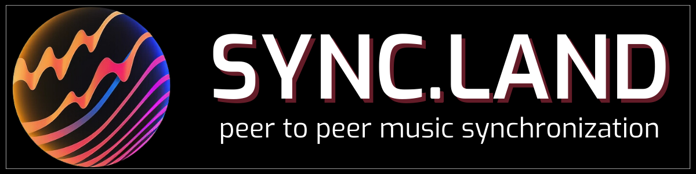

<p align="center">
  
</p>

# Sync.Land | Metaverse & Video Game Music Licensing
Visit our domain: https://sync.land

## Documentation

Here you can find links to all the documentation for each of the milestones throughout the progress of this project.
### [Milestone 1 - Initialization](https://github.com/Awen-online/sync.land/tree/main/docs/M1_Initialization)
>**Documents**
>
>[Design Document](M1_Initialization/SyncLand_Design_Report.pdf) - information about initial design, including infrastructure setup
>
>[Project Status Report](M1_Initialization/SyncLand_Project_Status.pdf) - Current project status
>
>[Project Timeline](M1_Initialization/SyncLand_Project_Timeline.pdf) - project roadmap, timeline, and responsibilities
>
>[Notion Kanban Board](https://awen-online.notion.site/2196b85886f941cf9f1d951b59ea230c?v=e71479497a5a4ea1810e4bf2c1018451) - board of all tasks, stories, and epics for this project


### [Milestone 2 - Development](https://github.com/Awen-online/sync.land/tree/main/docs/M2_Development)
>[Project Status Report](M2_Development/SyncLand_Project_Status_Report_M2.pdf) - Current project status
>
>[Project Timeline](M2_Development/SyncLand_Project_Timeline_M2.pdf) - project roadmap, timeline, and responsibilities
>
>[Pilot Marketing Document](M2_Development/SyncLand_Pilot_Marketing_Report.pdf) - information about pilot users selection & marketing setup
>
>[Test Case: Sync NFT License Metadata](M2_Development/Test_Case_-_Simple_NFT_Transaction_Sync_Metadata.mp4) - a simple Cardano transaction of an NFT on Cardano's Pre-production Network that includes metadata for a sync license
>
>[Test Case: User Registration & Song Upload](M2_Development/Test_Case_-_User_Registration_and_Song_Upload.mp4) - a user can register and upload a song to the marketplace
### [Milestone 3 - Marketplace Launch & API Development](https://github.com/Awen-online/sync.land/tree/main/docs/M3_Marketplace)
>[Project Status Report](M3_Marketplace/Sync.Land%20Project%20Status%20Report_M3.pdf) - Current project status
>
>[Project Timeline](M3_Marketplace/Sync.Land%20Project%20Timeline_M3.pdf) - updated project roadmap and timeline
>
>[User Feedback Report](M3_Marketplace/SyncLand_User_Feedback_Report_M3.pdf) - launch survey results, NPS, role-split feedback (licensee vs artist), admin dashboard screenshot
>
>[Marketplace & On-Chain Evidence](M3_Marketplace/SyncLand_Marketplace_and_OnChain_Evidence_M3.pdf) - visual tour of the live marketplace (homepage, browse, song page, album page) plus the verbatim CIP-25 metadata, policy ID, asset name, and Cardanoscan link for the test case mint
>
>[Test Case: NFT License Purchase](M3_Marketplace/Test_Case_-_NFT_License_Purchase.mp4) - end-to-end demo of a public user purchasing a sync license NFT on Cardano's Pre-production Network (mirror: [YouTube unlisted](https://www.youtube.com/watch?v=yt-R_F1wTGM))
>
>[API Documentation](M3_Marketplace/SyncLand_API_Documentation_M3.pdf) - REST API reference for the Sync.Land platform (songs, artists, albums, licensing, NFT, payments, playlists) generated from the [OpenAPI 3.0 spec](../code/docs/api-spec.yaml)
>
>[Live Marketplace](https://sync.land) - the public website
>
>**Launch announcements** (Awen socials, 2026-06-22):
>- [awen.online news post](https://awen.online/news/sync-land-launches-awens-peer-to-peer-music-licensing-platform-goes-live/) - Sync.Land launches: Awen's peer-to-peer music licensing platform goes live
>- [X / Twitter](https://x.com/awen_online/status/2069076274098606574) - launch thread by @awen_online
>- [LinkedIn](https://www.linkedin.com/posts/awenonline_the-wait-is-over-syncland-is-live-activity-7474841972634165248-u4_y) - "The wait is over — Sync.Land is live"
>- [Instagram](https://www.instagram.com/p/DZ5Iym_ks9i/) - launch announcement post
>
>**Platform code (open-core release, MIT)**:
>- [`code/`](../code/) - top-level docs, LICENSE, and the curated open-core subset (~2,860 lines of PHP across 9 modules; the proprietary marketplace logic stays behind the hosted site at https://sync.land)
>- [`code/wp-content/themes/syncland-open-core/`](../code/wp-content/themes/syncland-open-core/) - the open theme module map
>  - [`functions/seo/music-schema.php`](../code/wp-content/themes/syncland-open-core/functions/seo/music-schema.php) - Schema.org JSON-LD (MusicRecording / MusicAlbum / MusicGroup)
>  - [`functions/seo/dynamic-meta.php`](../code/wp-content/themes/syncland-open-core/functions/seo/dynamic-meta.php) - per-CPT title / description / og:image automation
>  - [`functions/analytics/`](../code/wp-content/themes/syncland-open-core/functions/analytics/) - role-aware feedback survey schema + UI
>  - [`functions/api/`](../code/wp-content/themes/syncland-open-core/functions/api/) - REST endpoints (analytics, security, songs, artists, search)
>- [`code/docs/api-spec.yaml`](../code/docs/api-spec.yaml) - full OpenAPI 3.0 spec (also rendered as the API Documentation PDF above)
>- [`LICENSE`](../LICENSE) / [`code/LICENSE`](../code/LICENSE) - MIT License (as declared in the Catalyst Fund 11 application)

### [Milestone 4 - Marketplace Updates & API Launch](https://github.com/Awen-online/sync.land/tree/main/docs/M4_API)
>**Documents**
>
>[Evidence Index](M4_API/SyncLand_Evidence_Index_M4.pdf) - maps each M4 acceptance criterion to the artefact that satisfies it; start here
>
>[Project Status Report](M4_API/SyncLand_Project_Status_Report_M4.pdf) - status against each acceptance criterion for the 2026-06-23 to 2026-08-17 reporting period
>
>[Project Timeline](M4_API/SyncLand_Project_Timeline_M4.pdf) - updated roadmap and delivery timeline
>
>[User Feedback Report](M4_API/SyncLand_User_Feedback_Report_M4.pdf) - survey responses and NPS, timestamped Terms of Service signatures, pitch activity on open briefs, behavioural analytics, and direct artist correspondence
>
>[Marketplace Updates](M4_API/SyncLand_Marketplace_Updates_M4.pdf) - the full changelog across five shipping cycles since M3, categorised, with verifiable commit hashes
>
>[API Documentation](M4_API/SyncLand_API_Documentation_M4.pdf) - current-state reference for the REST surface, including the `/streamer/*` namespace, the public licence verifier, authentication, CORS, and a live reproduction transcript
>
>[OBS Player Architecture](M4_API/SyncLand_OBS_Player_Architecture_M4.pdf) - how the dock and the streamer API fit together; the reference external application for acceptance criterion 3
>
>[Screenshots](M4_API/screenshots/) - licence verification on screen, and the on-stream attribution lower third
>
>**Verify it yourself, without credentials**
>
>Licence verification is public. No token, no account, no coordination with us:
>
>```
>https://www.sync.land/wp-json/FML/v1/licenses/11798/verify
>```
>
>That is the licence for "Ice" by Mie, the same one minted on-chain for the M3 demonstration. The response names the work, the artist, the licensee, the issue date, a retrievable PDF of the licence instrument, and the Cardano transaction that recorded it.
>
>The reference external application is live at [sync.land/dock/](https://sync.land/dock/), with source at [Awen-online/syncland-obs-player](https://github.com/Awen-online/syncland-obs-player) under Apache-2.0, released as [v0.2.0](https://github.com/Awen-online/syncland-obs-player/releases/tag/v0.2.0).
>
>**Launch announcements** (Awen socials, 2026-08-31):
>- [awen.online news post](https://awen.online/news/the-sync-land-dock-is-live-music-you-are-cleared-to-play/) - The Sync.Land dock is live: music you are cleared to play. What the dock solves for streamers, the guarantee it makes ("only music you are cleared to play"), the two-part dock and overlay setup, and the on-stream attribution badge.
>- [X / Twitter](https://x.com/awen_online/status/2094658900142293439) - launch post by @awen_online
>- [Instagram](https://www.instagram.com/p/Dcu6bQNFKJj/) - launch post
>- [LinkedIn](https://www.linkedin.com/feed/update/urn:li:activity:7500424603979141121) - launch post
>
>Milestone 4 output 3 is "the API module is publicly launched"; the above is that launch, following the same announcement pattern as the accepted M3 submission.
>
>**The API surface this milestone delivers**
>
>| Endpoint | Auth |
>|---|---|
>| `GET /licenses/{id}/verify` | none - public |
>| `GET /streamer/me` | Personal Access Token |
>| `GET /streamer/playlists` | Personal Access Token |
>| `GET /streamer/track/{id}/clearance` | Personal Access Token |
>| `POST /streamer/track/{id}/played` | Personal Access Token |
>| `GET` `POST /streamer/tokens` | same-origin, nonce |
>| `DELETE /streamer/tokens/{id}` | same-origin, nonce |
>
>All eight are specified in [`code/docs/api-spec.yaml`](../code/docs/api-spec.yaml) (OpenAPI 3.0, v1.2.0). Token management is deliberately nonce-authenticated rather than token-authenticated, so a Personal Access Token can never mint or revoke another token.
>
>*Test case screen recording: pending.*
### Milestone 5 - Finalization